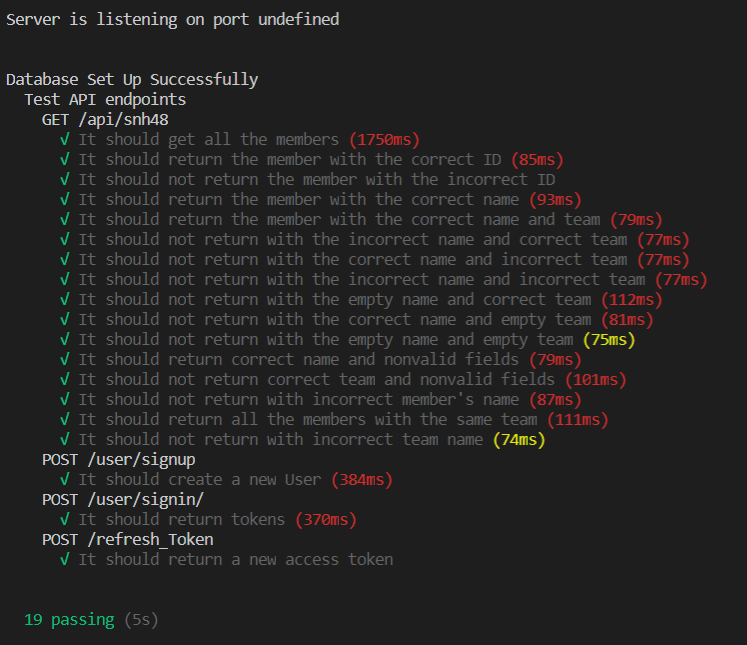

<h1>SNH48 REST API</h1>

<h2>Documentation</h2>
The documentation for SNH48 Rest API can be found <a href="https://app.swaggerhub.com/apis-docs/Duahau1/SNH48TEAM/1.1.2"> here </a> 

<h2>Additional Information</h2>

* Version 1.0.0 

  - The API contains profiles with pictures of current SNH48 team members (team SII,team NII,team HII, and team X).
  
  - The API gives you the options to view all current team members of SNH48 or each team. It also allows you to get each individuals information.
  
  - The API is created as part of celebration of SSK7 and SNH48's Gen 1's graduation.
* Version 1.1.1

  - The API requires you to sign in if you want to view individual team member or members of certain team.
  
  - Fix minor bugs and sanitize user input data using mongodb-sanitize.
  
  - Added admin permission for POST/PATCH request with the member's database.
  
  - Update member's age every 6 months.
* Version 1.1.2

  - Added memory cache to speed up GET request(speed up by 89% comparing to without cache - the result is calculted with 10 samples and Postman).
  - Added members of GNZ48 (team G, team NIII, and team Z).
  - Fixed HTTP_HEADERS error.
  - Added unit tests with Mocha and Chai.
  - Added members of BEJ48(Team B, Team E, Team J).

  

